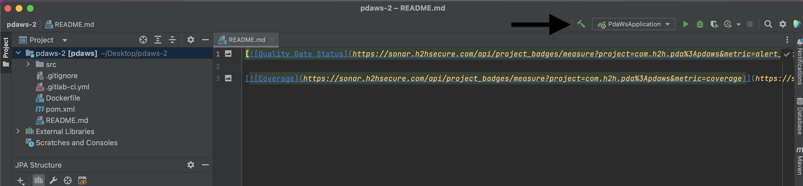
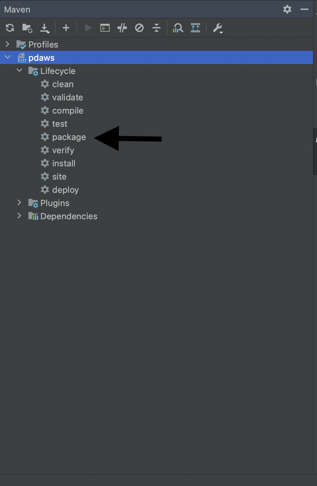

## PDAWS

 pdaws is main service for pdaccess pam ecosystem. 
 
### Installation

We will use [git](https://git-scm.com) to pull pdaws.

To start using Git from your computer, you must enter your credentials to identify yourself as the author of your work. The username and email address should match the ones you use in GitLab.

1-) In your shell, add your user name:

```bash
git config --global user.name "your_username"
```

2-)Add your email address:

```bash
git config --global user.email "your_email_address@example.com"
```

3-) To check the configuration, run:

```bash
git config --global --list
```

After installing and setting git we need to clone pdaws from gitlab.

1-) Go to pdaws landing page and select Clone. Copy the URL for Clone with HTTPS.
2-) Open a terminal and go to the directory where you want to clone the files.
3-) Run the following command. Git automatically creates a folder with the repository name and downloads the files there.

```bash
git clone https://git.h2hsecure.com/pda/pdaws.git
```

You can use SSH version of this code too.

```bash
git clone git@git.h2hsecure.com:pda/pdaws.git
```

### Starting pdaws

To start pdaws we need [maven](https://maven.apache.org/install.html), [intellij idea](https://www.jetbrains.com/idea/download/) and [docker](https://docs.docker.com/get-docker/). After installing these three components open project with IntelliJ Idea. After opening project we need to build project and start it.

#### Build Project
Build project using intellij as shown below.  

  

After building project you should see build completed successful on intellij build menu and target file in hierarchy.   

  

  

Then we need to create jar file for Docker. We can create it with IntelliJ maven menu which can be accessed with toolbar of intellij and "View > Tools > Maven" or from the right menu of intellij (shown with "m" letter). In maven menu open project file and double click to package to create .jar file.   



Now you are going to see .jar file on target folder.   

 

#### Start Project

To start project we can use DockerFile or terminal. To run on terminal use this commands to run container.

```bash
docker build .
docker run --publish 8080:8080 pdaws-docker
```

Or you can use intellij to run container. You can use second option to edit container settings and first option to run docker.  


Example of changing container settings.   

  

After running terminal command or clicking run on docker you will see container is deployed.

  

Now you can see your docker image on every docker usage (which includes docker terminal, docker desktop or intellij).
You can start container with clicking start button and access terminal with terminal button.

  

  

#### Run tests

```shell
mvn clean org.jacoco:jacoco-maven-plugin:prepare-agent verify org.jacoco:jacoco-maven-plugin:report -Psonar
```


#### build inside kubernetes

```shell
/kaniko/executor
      --context "${CI_PROJECT_DIR}"
      --dockerfile "${CI_PROJECT_DIR}/Dockerfile"
      --destination "${CI_REGISTRY_IMAGE}:${CI_COMMIT_SHA:0:8}"
      --cache=true
      --cache-copy-layers=true
```
